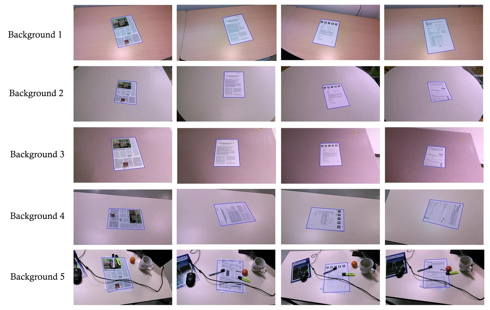

## Khurram Javed, Faisal Shaifait "Real-time Document Localization in Natural Images by Recursive Application of a CNN" 


Paper available at : www.ualberta.ca/~kjaved

This is a new and slightly improved implementation of the paper (Improved in the sense that the code is better commented and structured, and is more extendable to new models). If you are interested in the Tensorflow implementation which was used in the paper, please checkout the "server_branch" branch of this repository. 

## Dependencies
1. Pytorch 0.4.0
2. OpenCV
3. PIL 
4. Numpy
5. tqdm 

## Results on randomly selected test set images

## Datasets 
1. SmartDoc Competition 2 dataset : https://sites.google.com/site/icdar15smartdoc/challenge-1/challenge1dataset
2. Self-collected dataset : https://drive.google.com/drive/folders/0B9Sr0v9WkqCmekhjTTY2aV9hUmM?resourcekey=0-LT3nxEsFbvklyHdC2AjaYg&usp=sharing
3. Synthetic Dataset created by S.A Abbas and S.ul.Hussan [2] : https://drive.google.com/open?id=0B0ZBpkjFckxyNms0Smp0RWFsdTQ

## Preparing Dataset
 
To prepare the smartdoc dataset for training, run the following command: 

``` bash
python video_to_image.py --d ../path_to_smartdoc_videos/ --o ../path_to_store_frames
```
here the script video_to_image.py is in the smartdoc_data_processor folder. 

After converting to videos to frames, we need to convert the data into format required to train the models. We have to train two models. One to detect the four document corners, and the other to detect the a corner point in an image. To prepare data for the first model, run:
``` bash
python document_data_generator.py --d ../path_to_store_frames/ --o ../path_to_train_set
```
and for the second model, run:

``` bash
python corner_data_generator.py --i ../path_to_store_frames/ --o ../path_to_corner_train_set
```

You can also download a version of this data in the right format from here: 
https://drive.google.com/drive/folders/1N9M8dHIMt6sQdoqZ8Y66EJVQSaBTq9cX?usp=sharing

## Training using generated data

Now we can use the data to train our models. To train the document detector (The model that detects 4 corners), run:

``` bash
python train_model.py --name NameOfExperiment -i  pathToTrainSet1 pathToTrainSet2 
--lr 0.5 --schedule 20 30 35  -v pathToValidationSet --batch-size 16 
--model-type resnet --loader ram
``` 

And to train the corner refiner model, simple specify "--dataset corner" in the above command.

The results of the experiments will be stored in "../DDMMYYYY/NameOfExperiment." You can also specify the output directory using the --output-dir parameter. 

Note that you can use multiple datasets by providing a list in -i parameter. Finally, the --loader parameter specifies if the data is loaded in ram initially or not (Supported options are "hdd" or "ram"). If you have enough memory, it's better to load the data in ram (Otherwise the hard-drive can be a bottleneck). 

## Evaluating Performance 

You can evaluate the performance of the code using evaluate.py file. For evaluation, For now, you will have to hardcode the model state dictionary in the evaluate.py script. Also make sure that the correct version of the model is loaded by changing model type in evaluation/corner_extractor.py and evaluation/corner_refiner.py. I'll shift to a better, parameter based approach soon. 

Email : kjaved@ualberta.ca in-case of any queries. 

A version of trained models can be downloaded from : https://drive.google.com/drive/folders/1N9M8dHIMt6sQdoqZ8Y66EJVQSaBTq9cX

## Note
To those working on this problem, I would encourage trying out fully connected neural networks (Or some variant of pixel level segmentation network) as well; in my limited experiments, they are able to out-perform my method quite easily, and are more robust to unseen backgrounds (Probably because they are able to utilize context information of the whole page when making the prediction). They do tend to be a bit slower and require more memory though (Because a high-res image is used as input.) I might release my implemented of FCN based detector soon as well depending on my schedule. 

## Citing work 
If you end up using our code or dataset in your research, please consider citing:
``` bash
@inproceedings{javed2017real,
  title={Real-Time Document Localization in Natural Images by Recursive Application of a CNN},
  author={Javed, Khurram and Shafait, Faisal},
  booktitle={Document Analysis and Recognition (ICDAR), 2017 14th IAPR International Conference on},
  volume={1},
  pages={105--110},
  year={2017},
  organization={IEEE}
}
```


## References 
[1] S.A. Abbas and S.U.Hussain "Recovering Homography from Camera Captured Documents using Convolutional
               Neural Networks."
